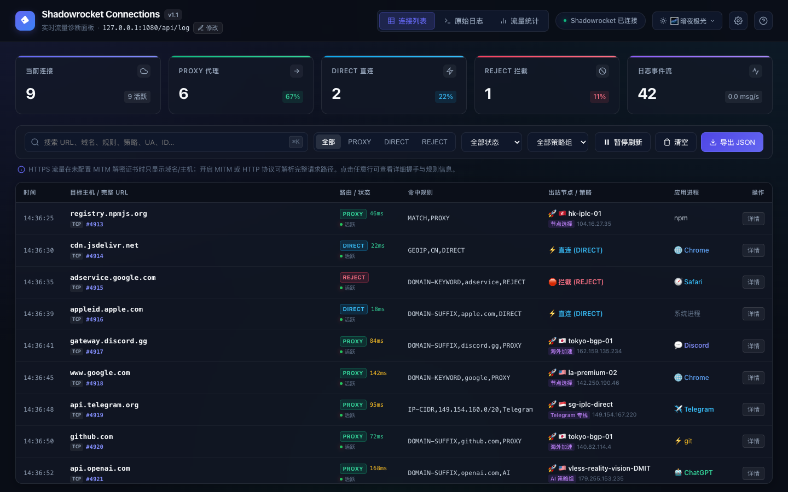
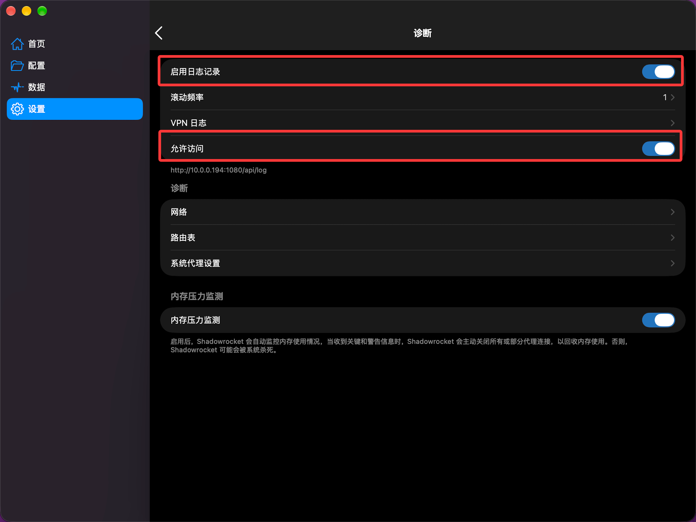

# 🚀 Shadowrocket Connections Dashboard

[](https://nodejs.org/)
[](#)
[](#)
[](#)

适用于 **Shadowrocket (小火箭)** 的现代化本机实时网络连接与流量诊断看板。通过解析 Shadowrocket 本地日志流 (`/api/log`)，提供直观的连接监控、路由分流分析、规则匹配诊断与原始日志控制台。

<p align="center">
  
</p>

---

## ✨ 核心特性

- ⚡️ **实时流式解析**：基于 SSE (Server-Sent Events) 双向保持连接，无缝捕获并结构化解析 Shadowrocket 诊断日志。
- 📊 **指标概览卡片**：实时统计当前活跃连接数、`PROXY` 代理分流占比、`DIRECT` 直连占比、`REJECT` 拦截计数与每秒日志处理吞吐量 (`msg/s`)。
- 🎛 **三重视图模式**：
  - 📋 **连接列表 (Table View)**：以结构化表格展示目标主机、分流路径、命中规则、出站策略/节点、握手耗时 (`Cost`) 与客户端应用识别。
  - 💻 **原始日志流 (Stream Console)**：类终端暗黑控制台，提供语法高亮、自动滚动锁定、行数统计与一键复制功能。
  - 📈 **流量统计图表 (Analytics View)**：直观展示高频访问域名 TOP 10、高频命中规则 TOP 10、出站路由比例与策略组分布。
- 🔍 **多维过滤与即时搜索**：
  - 支持快捷键 `⌘K` / `/` 聚焦搜索目标 URL、域名、规则、策略、UA、连接 ID。
  - 支持按 `PROXY` / `DIRECT` / `REJECT`、连接状态（活跃/已关闭）、策略组进行多重筛选。
  - 点击表格中的任意命中规则，即可一键快速过滤同类规则连接。
- 🎨 **多款高颜值精美皮肤**：内置 **5 款专属主题**（🌌 暗夜极光、🟣 东京之夜 Tokyo Night、⚡️ 赛博霓虹 Cyberpunk、🌑 黑曜纯黑 OLED、☀️ 极简明亮 Clean Light），支持按 <kbd>T</kbd> 快捷轮换或顶部下拉菜单一键切换，偏好自动持久化保存。
- 🔎 **深度详情抽屉 (Inspector)**：点击任意连接可滑出详情面板，查看完整的网络握手指标、目标解析、出站决策链路、客户端 User-Agent 以及该连接的全部原始日志碎片，并支持一键导出 JSON。
- 🔧 **动态 API 地址修改**：支持在网页端直接修改 Shadowrocket API 日志端点（如不同端口或局域网设备 IP），支持一键测试连通性并热重载重连，无需重启服务。
- 🔒 **纯本地只读与零依赖**：全站基于 Node.js 标准库与原生 Web 技术构建，零第三方 npm 依赖，默认仅绑定 `127.0.0.1` 本机环回地址，绝不收集或外发任何网络数据。

---

## 🏁 快速开始

### 🍎 方式 A：以 macOS 原生桌面应用运行与打包 (推荐)

项目内置了 Electron 桌面客户端配置，支持原生毛玻璃磨砂窗口、Dock 图标与独立应用窗口：

```bash
# 安装依赖
npm install

# 1. 直接以 macOS 桌面应用模式启动
npm run app

# 2. 一键打包生成 macOS 安装包 (.dmg 与 .app)
npm run dist:mac
```

打包完成后，安装包将输出至 `dist/` 目录：
- 💿 **`dist/Shadowrocket Dashboard-1.0.0-arm64.dmg`**（双击即可拖拽安装）
- 🚀 **`dist/mac-arm64/Shadowrocket Dashboard.app`**（原生应用包）

---

### 🌐 方式 B：以本地 Web 网页服务运行 (零依赖)

```bash
# 启动轻量 HTTP 服务
npm start
```

服务启动后，在浏览器中访问：👉 **http://127.0.0.1:8787**

---

### 2. 修改与配置 Shadowrocket API 地址

- **方法 1（推荐）**：打开网页或桌面应用后，直接点击顶部副标题中的 **「修改」** 按钮或右上角 **⚙️ 设置图标**（或按下快捷键 <kbd>S</kbd>），输入新的 API 地址（如 `http://127.0.0.1:1080/api/log` 或 `http://192.168.1.x:1080/api/log`），点击 **「保存并重连」** 即可。
- **方法 2（环境变量）**：通过环境变量在启动时指定：

```bash
# 指定自定义端口与 API 地址
PORT=9000 SHADOWROCKET_LOG_URL=http://127.0.0.1:1080/api/log npm start
```

---

## ⚙️ Shadowrocket 配置说明

若面板显示 **“未连接 Shadowrocket”** 或无法捕获流量，请按以下步骤开启 Shadowrocket 的诊断日志服务：

1. 打开 **Shadowrocket** 客户端。
2. 进入 **「设置 (Settings)」** → **「诊断 (Diagnostics)」**。
3. 确保开启 **「启用日志记录」** 与 **「允许访问」**（如下图红框所示）。
4. 确认日志服务地址（通常为 `http://127.0.0.1:1080/api/log` 或局域网 IP `http://10.0.0.x:1080/api/log`）。

<p align="center">
  
</p>

> 💡 **关于 HTTPS 完整路径显示说明**：
> - 未开启 HTTPS 解密 (MITM) 时，由于 TLS 握手特性，面板仅能解析出访问的目标域名及端口（例如 `api.github.com:443`）。
> - 若需要查看完整的 HTTP 请求路径（如 `/v1/chat/completions?model=...`），请在 Shadowrocket 中针对对应域名开启 **HTTPS 解密 (MITM)** 并信任相应根证书。

---

## ⌨️ 快捷键支持

| 快捷键 | 功能说明 |
| :--- | :--- |
| <kbd>⌘</kbd> + <kbd>K</kbd> 或 <kbd>/</kbd> | 快速聚焦搜索栏 |
| <kbd>T</kbd> | 快速轮换切换界面皮肤主题 (Theme) |
| <kbd>S</kbd> | 打开 Shadowrocket API 端点配置与测试弹窗 |
| <kbd>Space</kbd> (空格键) | 暂停 / 恢复实时日志流刷新 |
| <kbd>C</kbd> | 清空当前已捕获的连接记录与终端屏幕 |
| <kbd>?</kbd> | 打开快捷键与使用帮助弹窗 |
| <kbd>Esc</kbd> | 关闭连接详情抽屉或帮助弹窗 |

---

## ❓ 常见问题与日志机制 (FAQ)

### Q1: Shadowrocket 的日志会一直累计撑满磁盘吗？
- **不会**。Shadowrocket 客户端内置了**日志轮转与文件大小上限机制 (Log Rotation)**，单个日志文件通常限制在 10MB ~ 50MB 之间。当超出上限或跨周期时，它会自动覆盖并删除最老旧的日志文件，不会无限制占用磁盘。
- 如需手动清理，可在 Shadowrocket 客户端进入 **「设置」→「诊断与日志」**，点击底部的 **「清空日志」**。

### Q2: 本看板长期运行会不会持续占用电脑内存？
- **不会**。看板前端内置了**自动环形淘汰机制 (LRU Memory Pruning)**：
  - 连接记录常驻上限为 **1,000 条**，超出后自动优先淘汰已断开的最早连接。
  - 单条连接的详细追踪日志限制在 **20 条**以内，终端屏幕限制在 **500 行**以内。
  - 随时点击顶部 **「清空」** 按钮或刷新网页即可瞬间归零并释放所有内存。

### Q3: 为什么部分 HTTPS 请求只显示域名而没有完整 URL 路径？
- 这是由于 TLS/HTTPS 加密协议的特性。在未开启中间人解密时，代理软件仅能从 TLS SNI 握手阶段获取访问的域名与端口（如 `api.openai.com:443`）。
- 若需要分析完整的 HTTP 请求路径（如 `/v1/chat/completions`），请在 Shadowrocket 中针对目标域名配置 **HTTPS 解密 (MITM)** 并信任根证书。

---

## 📁 目录结构

```text
shadowrocket-dashboard/
├── package.json          # 项目配置与启动脚本
├── server.mjs            # Node.js 轻量后端（日志代理、SSE 广播、静态服务）
├── public/
│   └── index.html        # 现代化单页前端（暗黑界面、交互逻辑、图表与终端）
└── README.md             # 项目说明文档
```

---

## 🔒 隐私与安全性说明

- **完全只读**：本服务仅作为日志流的下游消费者，不会向 Shadowrocket 发送任何控制指令或修改系统代理配置。
- **本地安全绑定**：HTTP 服务与 SSE 流默认严格监听于 `127.0.0.1` 本机环回地址，局域网外不可访问。
- **零外部请求**：界面所有图标、样式与交互均内嵌实现，无需联网加载任何外部 CDN 资源，支持完全离线及内网隔离环境。

---

## 📄 License

MIT License. Feel free to use and customize!

